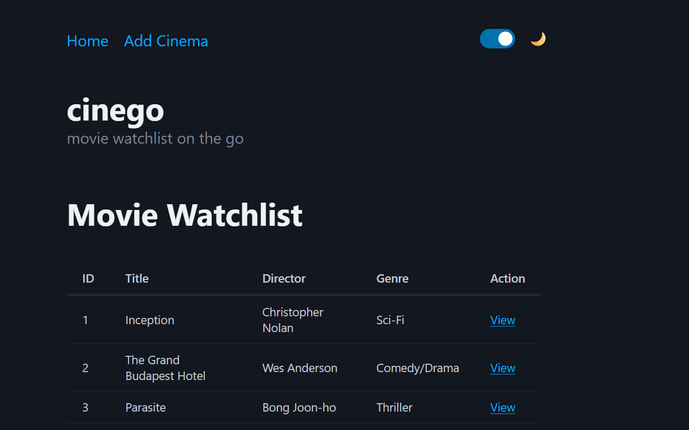
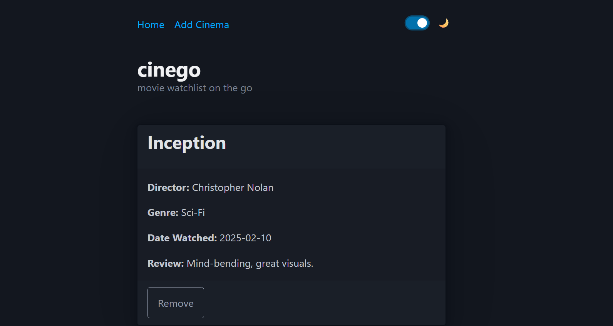
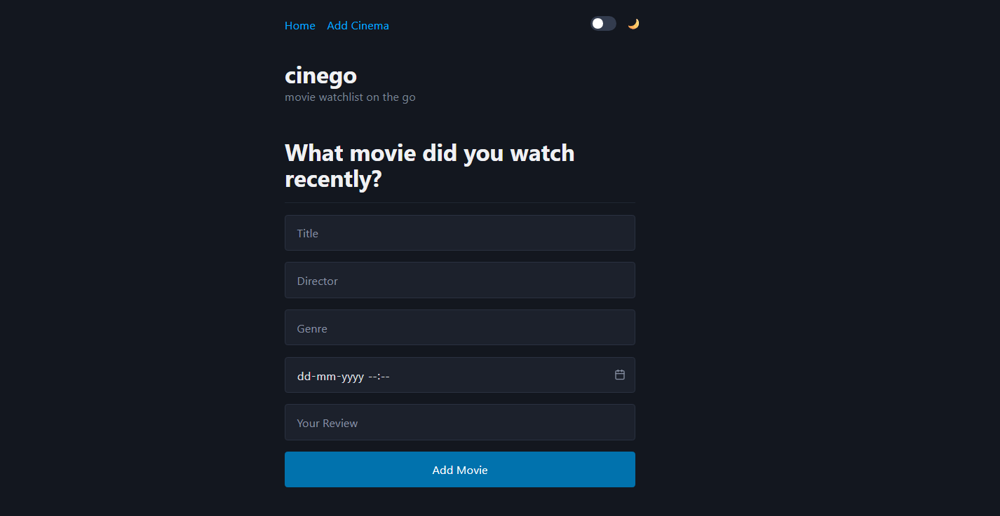

# 🎬 Movie Watch List (Atom Router)


---

## 🔍 Purpose

This app is built to:

- Manage a **movie watch list** with full **CRUD** (Create, Read, Update, Delete) via API.
- Add detailed movie entries (title, director,genre, date, reviews ).
- Navigate list and **individual movie pages** using **Atom Router** (dynamic `/:id` routes).
- **Toggle Light/Dark theme** for a better viewing experience.
- Persist data using a **MockBee** server (mock API).

---


 ***
## 🚀 Tech Stack

> HTML

> PICO CSS  

> MOCKBEE SERVER
---

***

## [GO LIVE](https://codesandbox.io/p/sandbox/ng6-assignment-1-2djkmx)


---

---


---

## 🧭 Core Features

- 🌗 **Theme Toggle** (Light/Dark switch)
- ➕ **Create**: Add a movie with details
- 📖 **Read**: View list & individual movie page
- ✏️ **Update**: Edit movie details
- 🗑️ **Delete**: Remove from watch list
- 🔎 **Route-based navigation**: `/movies`, `/movies/:id`, `/movies/new`, `/movies/:id/edit`

---

## 🛠️ Installation

```bash
git clone https://github.com/Sourabhpande532/cinego_moviewatchlist.git

```

***

## Skills Gained in the Project

- Building CRUD UIs with a mock REST backend.

- Setting up custom routes & dynamic params with Atom Router.

- Managing form state and optimistic UI updates.

- Handling theme state and CSS theming.

- Working with fetch/async patterns & error handling.